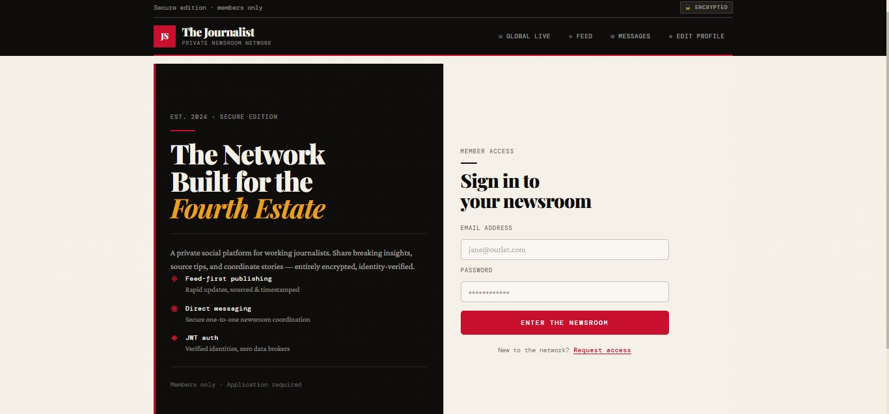
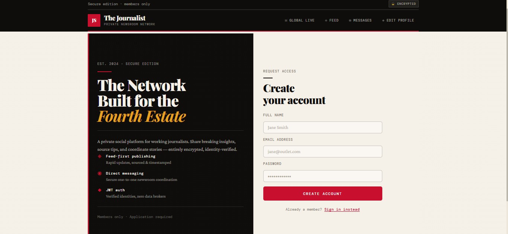
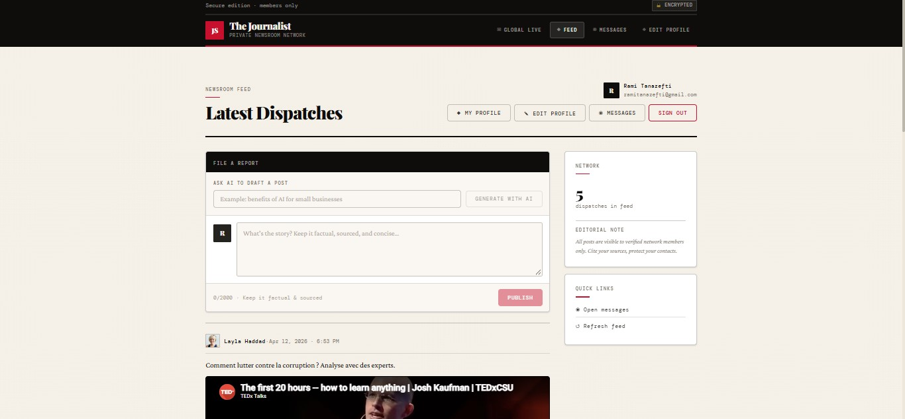
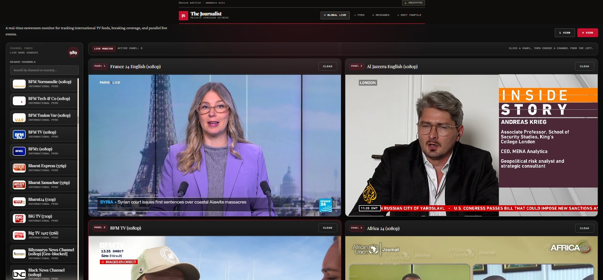
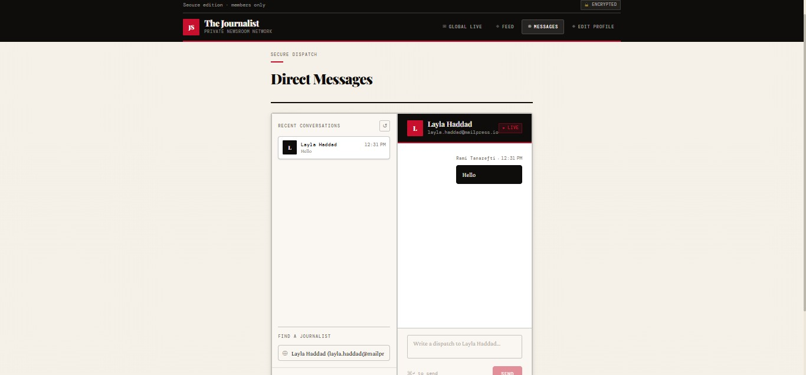

# 📰 NewsroomOS

> **Centralized digital workspace for modern journalists — monitor, collaborate, analyze, publish and follow live information from one platform.**

**NewsroomOS** est une plateforme web full-stack conçue comme un **poste de travail centralisé pour les journalistes et les équipes de rédaction**.

L'objectif principal de NewsroomOS est de réduire la fragmentation des outils utilisés quotidiennement dans une newsroom en regroupant plusieurs fonctionnalités essentielles dans une seule interface.

La plateforme permet notamment de :

- 📰 consulter et gérer des contenus journalistiques ;
- 📺 surveiller plusieurs flux grâce à un **TV Wall** ;
- 🤖 utiliser des outils basés sur l'intelligence artificielle ;
- ✍️ créer et gérer des publications ;
- 💬 communiquer avec les autres membres de la rédaction ;
- 👤 gérer les utilisateurs et leurs profils ;
- 🌍 suivre des contenus et informations en direct ;
- 🔐 sécuriser l'accès aux différentes fonctionnalités ;
- ⚡ centraliser les outils nécessaires au travail journalistique.

NewsroomOS est donc pensé comme un véritable **Newsroom Operating Workspace** : un environnement unique permettant aux journalistes de surveiller l'information, collaborer, analyser du contenu et travailler plus efficacement.

Le projet repose sur une architecture séparant clairement :

- **Angular** pour le frontend ;
- **Node.js / Express** pour le backend ;
- **MongoDB / Mongoose** pour la base de données ;
- **JWT / bcrypt** pour l'authentification et la sécurité ;
- **GitHub Actions** pour l'intégration continue ;
- des **fonctionnalités IA** intégrées au workspace.

---

# 📸 Aperçu de l'application

## 🔐 Login

<p align="center">
  
</p>

L'écran de connexion permet aux utilisateurs autorisés d'accéder de manière sécurisée à leur environnement NewsroomOS.

L'authentification repose sur un système de tokens JWT utilisés pour sécuriser les communications entre le frontend Angular et l'API backend.

---

## ✍️ Signup

<p align="center">
  
</p>

L'interface d'inscription permet aux nouveaux utilisateurs de créer un compte afin d'accéder aux fonctionnalités disponibles sur la plateforme.

---

## 📰 News Feed

<p align="center">
  
</p>

Le **News Feed** constitue l'un des espaces centraux de NewsroomOS.

Il permet de consulter les publications disponibles et de centraliser les contenus journalistiques directement dans le workspace.

---

## 📺 TV Wall

<p align="center">
  
</p>

Le **TV Wall** permet de suivre plusieurs contenus ou sources vidéo depuis une interface centralisée.

Cette fonctionnalité est particulièrement adaptée à une rédaction où plusieurs sources d'information doivent être surveillées simultanément.

Le TV Wall contribue à transformer NewsroomOS en véritable **centre de monitoring journalistique**.

---

## 💬 Messages

<p align="center">
  
</p>

La messagerie interne permet aux utilisateurs de communiquer directement depuis NewsroomOS sans quitter leur environnement de travail.

---

# 🎯 Concept NewsroomOS

NewsroomOS est conçu comme un système centralisé regroupant plusieurs composants d'une newsroom moderne.

```text
                             ┌─────────────────────────────┐
                             │         NewsroomOS          │
                             │                             │
                             │ Centralized Newsroom Hub    │
                             └──────────────┬──────────────┘
                                            │
             ┌──────────────────────────────┼──────────────────────────────┐
             │                              │                              │
             ▼                              ▼                              ▼
      ┌──────────────┐              ┌──────────────┐               ┌──────────────┐
      │  📰 News     │              │  📺 TV Wall │               │   🤖 AI      │
      │     Feed     │              │              │               │  Workspace   │
      └──────┬───────┘              └──────┬───────┘               └──────┬───────┘
             │                              │                              │
             └──────────────────────┬───────┴──────────────┬───────────────┘
                                    │                      │
                                    ▼                      ▼
                              ┌──────────────┐       ┌──────────────┐
                              │ 💬 Messaging │       │ ✍️ Publishing│
                              └──────┬───────┘       └──────┬───────┘
                                     │                      │
                                     └──────────┬───────────┘
                                                │
                                                ▼
                                      ┌──────────────────┐
                                      │ 👤 User Workspace │
                                      └──────────────────┘
```

L'idée est de proposer un environnement dans lequel un journaliste peut rester connecté à ses principales sources, surveiller les informations, utiliser des outils IA, communiquer avec son équipe et gérer ses contenus depuis une seule application.

---

# ✨ Fonctionnalités

## 🔐 Authentification & sécurité

- Inscription des utilisateurs
- Connexion sécurisée
- Authentification basée sur JWT
- Hashage des mots de passe avec bcrypt
- Protection des routes backend
- Middleware d'authentification
- Gestion du token côté frontend
- Angular Route Guards
- HTTP Interceptor Angular
- Variables d'environnement pour les données sensibles
- Exclusion du fichier `.env` du repository

---

## 📰 News Feed & publications

- Création de publications
- Consultation des publications
- Gestion des contenus journalistiques
- Fil d'actualité centralisé
- Interaction avec les contenus
- Gestion des données depuis l'API REST

---

## 📺 TV Wall

Le **TV Wall** permet de centraliser la surveillance de contenus en direct.

Il représente l'un des éléments principaux de NewsroomOS et permet d'intégrer la dimension **live monitoring** dans le poste de travail du journaliste.

### Objectifs

- Centraliser plusieurs flux
- Réduire le besoin d'utiliser plusieurs fenêtres
- Faciliter la surveillance de contenus en direct
- Donner une vision globale depuis un seul dashboard
- Améliorer la réactivité d'une équipe de rédaction

---

## 🤖 Intelligence Artificielle

NewsroomOS intègre également des fonctionnalités basées sur l'intelligence artificielle afin d'assister le travail journalistique.

Selon les fonctionnalités disponibles dans le workspace, l'IA peut être utilisée pour accompagner différentes tâches telles que :

- analyse de contenu ;
- résumé de textes ;
- assistance à la rédaction ;
- reformulation ;
- extraction d'informations ;
- traitement de contenus ;
- aide à la recherche ;
- organisation rapide de l'information.

L'objectif n'est pas de remplacer le journaliste, mais de proposer des outils capables d'accélérer certaines tâches répétitives ou analytiques.

---

## 💬 Messagerie

- Communication entre utilisateurs
- Gestion des messages
- API REST dédiée
- Routes protégées
- Intégration directement dans le workspace

---

## 👤 Gestion des utilisateurs

- Consultation du profil utilisateur
- Modification des informations
- Gestion du profil
- Protection des routes nécessitant une authentification
- Identification des utilisateurs connectés

---

## 🌍 Live / Actualités

- Interface dédiée aux contenus en direct
- Centralisation des informations
- Intégration avec l'environnement NewsroomOS
- Navigation depuis le workspace principal

---

# 🏗️ Architecture

NewsroomOS utilise une architecture **Frontend / Backend / Database**.

```text
                         ┌──────────────────────┐
                         │      Utilisateur     │
                         │      Web Browser     │
                         └──────────┬───────────┘
                                    │
                               HTTP / HTTPS
                                    │
                                    ▼
                    ┌─────────────────────────────┐
                    │          Angular            │
                    │          Frontend           │
                    │                             │
                    │ • Components                │
                    │ • Pages                     │
                    │ • Services                  │
                    │ • Guards                    │
                    │ • HTTP Interceptors         │
                    │ • News Feed                 │
                    │ • TV Wall                   │
                    │ • AI Workspace              │
                    └──────────────┬──────────────┘
                                   │
                                REST API
                                   │
                                   ▼
                    ┌─────────────────────────────┐
                    │      Node.js / Express      │
                    │           Backend           │
                    │                             │
                    │ • Routes                    │
                    │ • Middleware                │
                    │ • Authentication            │
                    │ • Business Logic            │
                    │ • API Services              │
                    └──────────────┬──────────────┘
                                   │
                                Mongoose
                                   │
                                   ▼
                    ┌─────────────────────────────┐
                    │           MongoDB           │
                    │                             │
                    │ • Users                     │
                    │ • Posts                     │
                    │ • Messages                  │
                    └─────────────────────────────┘
```

---

# 📁 Structure du projet

```text
NewsroomOS/
│
│
├── docs/
│   └── screenshots/
│       ├── login.png
│       ├── signup.png
│       ├── feed.png
│       ├── live-tv.png
│       └── messages.png
│
├── backend/
│   ├── package.json
│   ├── package-lock.json
│   ├── print.py
│   │
│   └── src/
│       ├── config/
│       │   └── db.js
│       │
│       ├── middleware/
│       │   └── auth.middleware.js
│       │
│       ├── models/
│       │   ├── Message.js
│       │   ├── Post.js
│       │   └── User.js
│       │
│       ├── routes/
│       │   ├── auth.routes.js
│       │   ├── message.routes.js
│       │   ├── post.routes.js
│       │   └── user.routes.js
│       │
│       └── server.js
│
├── frontend/
│   └── journalist-frontend/
│       ├── public/
│       │
│       ├── src/
│       │   └── app/
│       │       ├── guards/
│       │       ├── interceptors/
│       │       ├── pages/
│       │       └── services/
│       │
│       ├── angular.json
│       ├── package.json
│       ├── package-lock.json
│       ├── tsconfig.json
│       ├── tsconfig.app.json
│       └── tsconfig.spec.json
│
├── .gitignore
└── README.md
```

---

# 🛠️ Stack technique

## Frontend

- **Angular**
- **TypeScript**
- HTML5
- SCSS
- Angular Router
- Angular Services
- Angular HTTP Client
- Angular Route Guards
- HTTP Interceptors

---

## Backend

- **Node.js**
- **Express.js**
- JavaScript
- REST API
- JWT
- bcrypt
- dotenv

---

## Database

- **MongoDB**
- **Mongoose**

---

## DevOps & Version Control

- **Git**
- **GitHub**
- **GitHub Actions**
- npm
- Continuous Integration

---

# 🔄 Fonctionnement général

Le fonctionnement principal de NewsroomOS suit le flux suivant :

```text
Utilisateur
    │
    ▼
NewsroomOS Frontend
    │
    │ HTTP Request
    ▼
Angular Services
    │
    ▼
Express REST API
    │
    ├── Authentication
    │
    ├── Users
    │
    ├── Posts
    │
    ├── Messages
    │
    └── Services
    │
    ▼
MongoDB
    │
    ▼
Response
    │
    ▼
Angular Frontend
    │
    ▼
Interface NewsroomOS
    │
    ▼
Utilisateur
```

---

# 🔑 Authentification

Lorsqu'un utilisateur se connecte, le système d'authentification suit le processus suivant :

```text
Utilisateur
    │
    ▼
Login Form
    │
    ▼
Angular
    │
    │ POST /auth/login
    ▼
Express API
    │
    ▼
Vérification des identifiants
    │
    ▼
bcrypt
    │
    ▼
JWT généré
    │
    ▼
Angular reçoit le token
    │
    ▼
Stockage / gestion du token
    │
    ▼
HTTP Interceptor
    │
    ▼
Authorization: Bearer <token>
    │
    ▼
Middleware Auth
    │
    ▼
Route protégée
```

Le middleware d'authentification vérifie le JWT avant d'autoriser l'accès aux ressources protégées.

---

# 🔐 Sécurité

La sécurité repose sur plusieurs mécanismes.

## Gestion des mots de passe

Les mots de passe ne sont pas stockés directement.

Ils sont hashés avec :

```text
bcrypt
```

---

## JSON Web Token

Après une authentification valide, le backend génère un token JWT.

Le token est ensuite utilisé pour les requêtes vers les routes protégées.

```text
Client
  │
  │ Authorization: Bearer JWT
  ▼
Express Middleware
  │
  ├── Token valide
  │       │
  │       ▼
  │   Route autorisée
  │
  └── Token invalide
          │
          ▼
      Access denied
```

---

# 🌱 Variables d'environnement

Les informations sensibles sont stockées dans un fichier `.env`.

Exemple :

```env
PORT=5000
MONGO_URI=your_mongodb_connection_string
JWT_SECRET=your_secure_jwt_secret
```

Le fichier `.env` ne doit jamais être ajouté au repository.

Exemple de `.gitignore` :

```gitignore
# Dependencies
node_modules/

# Environment
.env
.env.*

# Angular
.angular/
dist/

# Logs
*.log

# OS
.DS_Store
Thumbs.db
```

> ⚠️ Les vraies valeurs de `MONGO_URI`, `JWT_SECRET`, clés API et autres secrets doivent rester privées.

---

# 📡 API REST

Le backend expose plusieurs groupes de routes REST.

| Domaine | Route | Description |
|---|---|---|
| Authentication | `/auth/*` | Inscription et connexion |
| Users | `/users/*` | Gestion des utilisateurs |
| Posts | `/posts/*` | Gestion des publications |
| Messages | `/messages/*` | Gestion des messages |

Les endpoints peuvent évoluer au fur et à mesure du développement de NewsroomOS.

---

# 🔄 Continuous Integration — CI

NewsroomOS utilise **GitHub Actions** pour automatiser les vérifications du projet.

Le workflow CI est exécuté automatiquement lors des événements configurés dans le repository.

```text
Developer
    │
    │ git push
    ▼
GitHub Repository
    │
    ▼
GitHub Actions
    │
    ├── Checkout repository
    │
    ├── Setup Node.js
    │
    ├── Install dependencies
    │
    ├── Run checks
    │
    ├── Run tests
    │
    └── Build project
    │
    ▼
CI Validation
```

## Objectifs de la CI

- Automatiser les vérifications
- Vérifier l'installation des dépendances
- Détecter rapidement les erreurs
- Exécuter les tests disponibles
- Vérifier que le frontend peut être compilé
- Réduire les erreurs avant intégration
- Améliorer la qualité du projet

---

# 🧪 Tests

Le frontend Angular contient une configuration dédiée aux tests.

Pour exécuter les tests :

```bash
npm test
```

ou :

```bash
ng test
```

Les tests peuvent également être exécutés automatiquement depuis GitHub Actions.

---

# 🚀 Installation

## Prérequis

Installer les outils suivants :

- Node.js
- npm
- MongoDB
- Git
- Angular CLI si nécessaire

Vérifier les versions :

```bash
node --version
npm --version
git --version
```

---

# 📥 Cloner NewsroomOS

```bash
git clone https://github.com/NameRami/NewsroomOS.git
```

Puis :

```bash
cd NewsroomOS
```

---

# ⚙️ Configuration du backend

Entrer dans le dossier backend :

```bash
cd backend
```

Installer les dépendances :

```bash
npm install
```

Créer un fichier :

```text
.env
```

Ajouter :

```env
PORT=5000
MONGO_URI=your_mongodb_connection_string
JWT_SECRET=your_secure_jwt_secret
```

Démarrer le backend :

```bash
npm start
```

Serveur :

```text
http://localhost:5000
```

---

# 💻 Configuration du frontend

Dans un autre terminal :

```bash
cd frontend/journalist-frontend
```

Installer les dépendances :

```bash
npm install
```

Lancer Angular :

```bash
npm start
```

ou :

```bash
ng serve
```

Frontend :

```text
http://localhost:4200
```

---

# 🔄 Cycle d'une requête

```text
┌───────────────┐
│     User      │
└───────┬───────┘
        │
        ▼
┌───────────────┐
│ Angular Page  │
└───────┬───────┘
        │
        ▼
┌───────────────┐
│ Angular       │
│ Service       │
└───────┬───────┘
        │ HTTP
        ▼
┌───────────────┐
│ Express Route │
└───────┬───────┘
        │
        ▼
┌───────────────┐
│ Middleware    │
└───────┬───────┘
        │
        ▼
┌───────────────┐
│ Business      │
│ Logic         │
└───────┬───────┘
        │
        ▼
┌───────────────┐
│   Mongoose    │
└───────┬───────┘
        │
        ▼
┌───────────────┐
│    MongoDB    │
└───────┬───────┘
        │
        ▼
     Response
```

---

# 🧠 Positionnement de l'IA

L'intelligence artificielle constitue une extension importante du concept NewsroomOS.

```text
                      ┌──────────────────────┐
                      │     Journalist       │
                      └──────────┬───────────┘
                                 │
                                 ▼
                     ┌─────────────────────────┐
                     │       NewsroomOS        │
                     └────────────┬────────────┘
                                  │
             ┌────────────────────┼────────────────────┐
             │                    │                    │
             ▼                    ▼                    ▼
        News Content          AI Tools             Live Data
             │                    │                    │
             │             ┌──────┴──────┐             │
             │             │             │             │
             ▼             ▼             ▼             ▼
        Monitoring      Analysis       Assist.      TV Wall
                           │           Writing
                           │
                           ▼
                      Journalist
                      Decision
```

L'IA agit comme une couche d'assistance intégrée au workspace, tandis que la validation finale et les décisions éditoriales restent sous le contrôle du journaliste.

---

# 📊 État du projet

| Fonctionnalité | État |
|---|---|
| Architecture frontend/backend | ✅ |
| Angular | ✅ |
| Node.js / Express | ✅ |
| MongoDB / Mongoose | ✅ |
| Authentification | ✅ |
| JWT | ✅ |
| bcrypt | ✅ |
| Gestion utilisateurs | ✅ |
| Publications | ✅ |
| News Feed | ✅ |
| Messagerie | ✅ |
| Profil utilisateur | ✅ |
| TV Wall | ✅ |
| Fonctionnalités IA | ✅ |
| Angular Guards | ✅ |
| HTTP Interceptors | ✅ |
| Variables d'environnement | ✅ |
| Git / GitHub | ✅ |
| GitHub Actions | ✅ |
| Continuous Integration | ✅ |
| Tests avancés | 🚧 |
| Documentation API complète | 🚧 |
| Docker | 🚧 |
| Docker Compose | 🚧 |
| Continuous Deployment | 🚧 |
| Déploiement production | 🚧 |
| Monitoring | 🚧 |
| Logs structurés | 🚧 |

---

# 🗺️ Roadmap

## Phase 1 — Core Platform

- [x] Architecture frontend/backend
- [x] Angular
- [x] Express API
- [x] MongoDB
- [x] Authentification
- [x] Gestion utilisateurs
- [x] Publications
- [x] Messagerie
- [x] Profils utilisateurs

---

## Phase 2 — Newsroom Workspace

- [x] News Feed
- [x] Live interface
- [x] TV Wall
- [x] Centralisation des outils
- [x] Messagerie intégrée
- [x] Workspace utilisateur

---

## Phase 3 — Intelligence Artificielle

- [x] Intégration de fonctionnalités IA
- [x] Assistance intégrée au workspace
- [ ] Enrichissement des outils d'analyse
- [ ] Résumé automatique avancé
- [ ] Extraction intelligente d'informations
- [ ] Classification automatique des contenus
- [ ] Recherche assistée par IA

---

## Phase 4 — Qualité & CI

- [x] Git
- [x] GitHub
- [x] GitHub Actions
- [x] Pipeline CI
- [x] Automatisation des vérifications
- [ ] Augmentation de la couverture des tests
- [ ] Analyse automatique de qualité
- [ ] Tests backend supplémentaires

---

## Phase 5 — Conteneurisation

- [ ] Docker backend
- [ ] Docker frontend
- [ ] Docker Compose
- [ ] Optimisation des images
- [ ] Environnement reproductible

---

## Phase 6 — Deployment

- [ ] Continuous Deployment
- [ ] Déploiement VPS / Cloud
- [ ] Staging environment
- [ ] Production environment
- [ ] Gestion centralisée des secrets

---

## Phase 7 — Observabilité

- [ ] Logs structurés
- [ ] Monitoring
- [ ] Métriques
- [ ] Dashboards
- [ ] Alerting

---

# 🎯 Vision DevOps

L'objectif à terme est de transformer NewsroomOS en une plateforme disposant d'une chaîne DevOps complète.

```text
                ┌──────────────┐
                │     Git      │
                └──────┬───────┘
                       │
                       ▼
                ┌──────────────┐
                │    GitHub    │
                └──────┬───────┘
                       │
                       ▼
             ┌───────────────────┐
             │   GitHub Actions  │
             │        CI         │
             └─────────┬─────────┘
                       │
                       ▼
                ┌──────────────┐
                │     Tests    │
                └──────┬───────┘
                       │
                       ▼
                 ┌─────────────┐
                 │    Build    │
                 └──────┬──────┘
                        │
                        ▼
                  [ À venir ]
                        │
               ┌────────┴────────┐
               ▼                 ▼
            Docker              CD
               │                 │
               └────────┬────────┘
                        ▼
                  Déploiement
                        │
                        ▼
                   Monitoring
```

### État actuel

```text
Git
 │
 ▼
GitHub
 │
 ▼
GitHub Actions
 │
 ▼
Continuous Integration
 │
 ▼
Build / Verification
 │
 ▼
✅ Current DevOps Stage


Docker
 │
 ▼
Continuous Deployment
 │
 ▼
Production
 │
 ▼
Monitoring
 │
 ▼
🚧 Next Stages
```

---

# 🌐 Vision globale de NewsroomOS

```text
                               NEWSROOMOS
                                   │
             ┌─────────────────────┼─────────────────────┐
             │                     │                     │
             ▼                     ▼                     ▼
        INFORMATION           COLLABORATION          PRODUCTIVITY
             │                     │                     │
      ┌──────┴──────┐        ┌─────┴─────┐         ┌─────┴─────┐
      │             │        │           │         │           │
      ▼             ▼        ▼           ▼         ▼           ▼
 News Feed       TV Wall   Messages    Users       AI       Publishing
      │             │        │           │         │           │
      └─────────────┴────────┴─────┬─────┴─────────┴───────────┘
                                   │
                                   ▼
                         ┌──────────────────┐
                         │ Journalist Desk  │
                         │ Unified Workspace│
                         └──────────────────┘
```

La vision de NewsroomOS est de fournir une interface unique réunissant les outils essentiels au fonctionnement quotidien d'une rédaction numérique moderne.

---

# 🤝 Contribution

Pour contribuer au projet :

1. Forker le repository
2. Créer une branche
3. Effectuer les modifications
4. Ajouter ou mettre à jour les tests
5. Commit les changements
6. Push la branche
7. Créer une Pull Request

Créer une branche :

```bash
git checkout -b feature/new-feature
```

Commit :

```bash
git add .
git commit -m "feat: add new feature"
```

Push :

```bash
git push origin feature/new-feature
```

---

# 👨‍💻 Auteur

**Rami Tanazefti**

Élève ingénieur en informatique — **DevOps & MLOps**

🇹🇳 Tunisie

### GitHub

```text
https://github.com/NameRami
```

### Repository

```text
https://github.com/NameRami/NewsroomOS
```

---

# 📄 Licence

NewsroomOS est actuellement développé dans un cadre **académique, expérimental et de démonstration**.

Une licence open-source pourra être ajoutée ultérieurement selon l'évolution du projet.

---

# 📰 NewsroomOS

**Monitor. Analyze. Collaborate. Publish.**

> One workspace for the modern newsroom.
